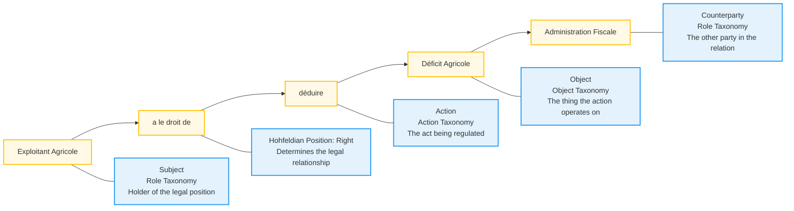
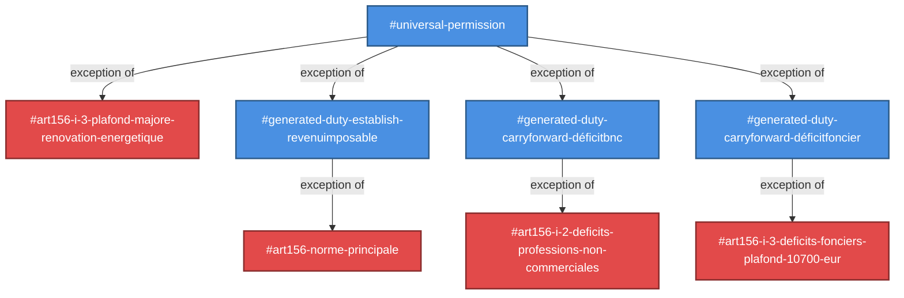

# OpenNorm — Formal Verification for Legal Documents

> A formal notation for writing governance documents that can be read by humans
> and verified by machines, applicable at any scale from a software license
> to a regulatory compliance framework.

**Current Status:** Working implementation with French tax code (Code Général des Impôts Article 156)

[](https://opensource.org/licenses/Apache-2.0)
[](https://julialang.org/)

---

## Table of Contents

1. [Vision and Strategic Context](#1-vision-and-strategic-context)
2. [Core Design Philosophy](#2-core-design-philosophy)
3. [Architecture Overview](#3-architecture-overview)
4. [The Three-Layer System](#4-the-three-layer-system)
5. [Technology Stack](#5-technology-stack)
6. [Quick Start](#6-quick-start)
7. [Import System & Modular Architecture](#7-import-system--modular-architecture)
8. [The OpenNorm Document Format](#8-the-opennorm-document-format)
9. [Hohfeldian Position System](#9-hohfeldian-position-system)
10. [Taxonomy System](#10-taxonomy-system)
11. [Dimensional Analysis](#11-dimensional-analysis)
12. [SMT Validation with Z3](#12-smt-validation-with-z3)
13. [Code Generation](#13-code-generation)
14. [The Universal Grundnorm](#14-the-universal-grundnorm)
15. [Built-in Constraints & Verification](#15-built-in-constraints--verification)
16. [CLI Interface](#16-cli-interface)
17. [Development](#17-development)

---

## 1. Vision and Strategic Context

### 1.1 The Problem with Legal and Governance Documents

Legal documents — licenses, contracts, charters, regulatory frameworks — share a
structural failure: they are written once, sometimes under time pressure, by a small group,
with no formal mechanism to detect internal contradictions, no versioning system,
no automated testing, and no way to check whether a new clause conflicts with an
existing one.

The consequences are severe:

- **Ambiguity accumulates.** Terms are left undefined. Courts resolve them decades later, inconsistently.
- **No contradiction detection.** A document can simultaneously grant and prohibit the same action.
- **Compliance is manual.** Verifying compliance requires expensive, point-in-time, non-reproducible human review.
- **Calculations are opaque.** Tax codes and regulations contain complex calculations that are difficult to verify.

### 1.2 The OpenNorm Approach

OpenNorm applies formal methods to legal documents through three key innovations:

1. **Hohfeldian Position System** — Every legal relationship is expressed as one of eight fundamental positions (Right, Duty, Privilege, NoRight, Power, Disability, Liability, Immunity), enabling precise contradiction detection.

2. **Three-Layer Architecture** — Separates normative rules (Layer 1) from computational procedures (Layer 2) from implementation code (Layer 3), allowing each to be verified independently.

3. **Dimensional Analysis** — Type-checks calculations with units (EUR, years, dates) to catch dimensional mismatches before runtime.

### 1.3 Current Focus: French Tax Code

The current implementation focuses on the French tax code (Code Général des Impôts), specifically Article 156 on income tax deductions and deficit carryforward rules. This provides:

- **Real-world complexity** — Multi-article regulations with exceptions and cross-references
- **Computational requirements** — Tax calculations with dimensional constraints
- **Practical value** — Generates executable OpenFisca code for tax simulations
- **Validation target** — SMT solver verifies logical consistency of rules

---

## 2. Core Design Philosophy

### 2.1 The Primary Constraint

> **The .md document must be indistinguishable from a well-formatted legal
> document to someone who has never heard of OpenNorm.**

This is not a preference. It is a hard constraint that governs every design
decision. Complexity is hidden in the tooling, never exposed in the document.

### 2.2 The Single Source of Truth

> **Every .md file is the source of truth. All generated code is derived from markdown.**

All generated `.py` (OpenFisca), `.lean`, or other files are outputs. They are never edited
directly. If a generated file is lost, it is regenerated from the `.md` source.

### 2.3 Three Term States

Every term in an OpenNorm document is in one of three states:

| State | Syntax | Meaning | Checker Response |
|---|---|---|---|
| **Resolved** | `*distribute*` | Defined in taxonomy | Verified against taxonomy |
| **Fuzzy** | `~~reasonable~~` | Intentionally flexible | Warning issued |
| **Undefined** | `distribute` (plain) | Not declared anywhere | Hard error in final mode |

### 2.4 Warnings vs Errors

```
ERROR   — the document is structurally broken
          must be resolved before finalization
          example: undefined term, contradiction detected

WARNING — the document is valid but has known limitations
          human judgment required at point of application
          example: computed variable has no type declaration
          example: no jurisdiction declared
```

---

## 3. Architecture Overview

### 3.1 The Three-Layer System

OpenNorm separates legal documents into three distinct layers:

```
┌─────────────────────────────────────────────────────────┐
│  LAYER 1: NORMATIVE LAYER (Hohfeldian Norms)          │
│  - Rights, duties, privileges, powers                   │
│  - Exception hierarchies                                │
│  - Jurisdiction constraints                             │
│  - Validated by Z3 SMT solver                          │
└─────────────────────────────────────────────────────────┘
                          ↓
┌─────────────────────────────────────────────────────────┐
│  LAYER 2: OPERATIONAL LAYER (Procedures)               │
│  - Computational procedures                             │
│  - Case expressions and conditions                      │
│  - Dimensional analysis with Unitful                    │
│  - Type-checked calculations                            │
└─────────────────────────────────────────────────────────┘
                          ↓
┌─────────────────────────────────────────────────────────┐
│  LAYER 3: IMPLEMENTATION LAYER (Code Generation)       │
│  - OpenFisca Python code                                │
│  - YAML parameter files                                 │
│  - Dependency graphs                                    │
│  - Executable tax simulations                           │
└─────────────────────────────────────────────────────────┘
```


**Three-Layer Pipeline:**

### Layer 1: Normative Layer

**Purpose:** Validate OpenNorm syntax and semantic correctness

**Steps:**

1. **Load & Parse Manifest** → Returns: Manifest metadata + import list
2. **Parse & Merge Taxonomies** → Returns: 4 merged taxonomies (Entity, Role, Action, Object)
3. **Parse Norms** → Returns: List of Hohfeldian norms with positions
4. **Validate Norms** → Returns: Validated norms with exception hierarchy

**Output:** ✅ OpenNorm syntax verified, all terms defined, exception hierarchy valid

**Errors:** Invalid syntax, undefined terms, taxonomy conflicts, circular imports

---

### Layer 2: Operational Layer

**Purpose:** Validate variable types and dimensional consistency

**Steps:**

1. **Parse Procedures** → Returns: Procedure ASTs from Layer 2 sections
2. **Build IR** → Returns: Complete DocumentIR with all components
3. **Dimensional Analysis** → Returns: Type-checked IR with validated units

**Output:** ✅ Variable types verified, taxonomy respected, unit consistency validated

**Errors:** Type mismatches, incompatible units, undefined variables, missing type declarations

---

### Layer 3: Implementation Layer
**Purpose:** Translate to executable code and verify logical consistency

**Steps:**
1. **SMT Translation** → Returns: Z3 assertions representing norms
2. **Z3 Solver** → Returns: SAT (consistent) / UNSAT (contradictions) / UNKNOWN
3. **Code Generation** (optional) → Returns: OpenFisca Python, YAML parameters, dependency graphs

**Output:** ✅ Document translated to code, logical consistency verified

**Errors:** Translation failures, contradictions detected (Hohfeldian opposites), code generation errors

---

## 4. The Three-Layer System

### 4.1 Layer 1: Normative Layer (Norms)

**Purpose:** Express legal relationships using Hohfeldian positions.

**Syntax:**

```markdown
### Rule Title

*Actor* **Position** *action* *object* to/from/by/over *Counterparty*
```

**Example:**

```markdown
### Deduction Right

*Propriétaire* **a le droit de** *déduire* *Déficit Foncier* à *Administration Fiscale*
```

**Validation:** Z3 SMT solver checks for:

- Contradictions (simultaneous Right and NoRight)
- Subsumption relationships via taxonomy
- Exception hierarchy consistency
- Jurisdiction constraints

### 4.2 Layer 2: Operational Layer (Procedures)

**Purpose:** Define computational procedures with type-checked calculations.

**Syntax:**

```markdown
## *Variable Name*

> Description

*Variable* = expression
```

**Example:**

```markdown
## *Déficit Agricole Imputable*

> Montant du déficit agricole imputable sur le revenu global

*Déficit Agricole Imputable* = min(*Déficit Agricole*, *Seuil Revenu Agricole*)
```

**Validation:** Dimensional analysis checks:

- Unit consistency (EUR + EUR = EUR, not EUR + years)
- Type declarations in taxonomy
- Variable references are defined

### 4.3 Layer 3: Implementation Layer (Code Generation)

**Purpose:** Generate executable code from validated procedures.

**Outputs:**

- **OpenFisca Python** — Tax calculation variables
- **YAML parameters** — Time-varying parameters
- **Dependency graphs** — Mermaid flowcharts

**Possible outputs:**

- **Solidity** - Smart Contracts
- **Catala** - Legal Tax code

**Example Generated OpenFisca Code:**

```python
class deficit_agricole_imputable(Variable):
    value_type = float
    entity = FoyerFiscal
    definition_period = YEAR
    label = "Montant du déficit agricole imputable"
    
    def formula(foyer_fiscal, period, parameters):
        deficit = foyer_fiscal('deficit_agricole', period)
        seuil = foyer_fiscal('seuil_revenu_agricole', period)
        return min_(deficit, seuil)
```

---

## 5. Technology Stack

### 5.1 Core Technologies

| Component | Technology | Rationale |
|---|---|---|
| **Language** | Julia 1.12+ | Multiple dispatch, metaprogramming, scientific computing |
| **Parser** | CommonMark.jl | Native markdown parsing, fast, type-safe |
| **Formal Verification** | Z3 SMT Solver | Industry-standard, handles quantifiers and theories |
| **Type Checking** | Unitful.jl | Dimensional analysis with compile-time checking |
| **Code Generation** | Julia metaprogramming | Direct AST manipulation, clean code generation |
| **Target Platform** | OpenFisca | Standard for tax/benefit microsimulation |
| **Format** | Markdown | Universal, readable, version-controllable |

### 5.2 Why Julia?

- **Multiple dispatch** — Natural fit for AST traversal and code generation
- **Type system** — Strong typing with parametric types for IR nodes
- **Metaprogramming** — Powerful macro system for DSL construction
- **Scientific computing** — Unitful.jl provides dimensional analysis
- **Performance** — JIT compilation for fast parsing and validation
- **Interop** — Easy integration with Z3 via Z3.jl

### 5.3 Why Z3?

- **SMT theories** — Supports quantifiers, uninterpreted functions, datatypes
- **Proven** — Used in Microsoft, Amazon, and academic formal verification
- **Decidable fragments** — Can prove satisfiability for many legal constraints
- **Counterexamples** — When unsatisfiable, provides concrete contradiction
- **Active development** — Regular updates and bug fixes

---

## 6. Quick Start

### 6.1 Installation

**Prerequisites:**
- Julia 1.12 or higher
- Git

**Install Julia:**

```bash
# macOS (via Homebrew)
brew install julia

# Linux (via juliaup)
curl -fsSL https://install.julialang.org | sh

# Windows (via juliaup)
winget install julia -s msstore
```

**Clone and Setup:**

```bash
# Clone the repository
git clone https://github.com/atthom/opennorm.git
cd opennorm

# Install dependencies
julia --project=. -e 'using Pkg; Pkg.instantiate()'
```

### 6.2 Basic Usage

**Validate a document:**

```bash
julia --project=. src/opennorm.jl documents/articles/CGI.Art.156.md
```

**Generate OpenFisca code:**

```bash
julia --project=. src/opennorm.jl documents/articles/CGI.Art.156.md \
  --openfisca output.py
```

**Generate with dependency graph:**

```bash
julia --project=. src/opennorm.jl documents/articles/CGI.Art.156.md \
  --openfisca output.py --graph
```

### 6.3 Run Tests

```bash
# Run all tests
julia --project=. test/runtests.jl

# Run specific test category
julia --project=. -e 'using Test; include("test/parser/test_manifest.jl")'
```

---

## 7. Import System & Modular Architecture

### 7.1 Purpose: Composable Legal Documents

OpenNorm's import system enables legal documents to be decomposed into logical, maintainable modules. Rather than encoding an entire regulation in a single monolithic file, complex legal frameworks can be split into meaningful parts that can be independently developed, tested, and reused.

### 7.2 Benefits of Modular Architecture

**Document Decomposition**

- Break large legal documents into coherent, focused modules
- Each module handles a specific aspect (e.g., agricultural deficits, business deficits)
- Easier to understand, maintain, and update individual components

**Reusable Components**

- Import pre-encoded jurisdictions (e.g., `FR.Constitution`, `EU.Regulation`)
- Reuse common taxonomies across multiple documents
- Share standard definitions from stdlib frameworks

**Dependency Networks**

- Files can import other files, creating rich dependency graphs
- Transitive imports automatically resolved
- Circular dependency detection prevents logical loops

**Version Management**

- Semantic versioning ensures compatibility (`@3.0`, `@2.1`)
- Pin specific versions for stability
- Track which version of dependencies a document relies on

### 7.3 Real-World Example: CGI Article 156

The French tax code Article 156 demonstrates modular architecture:

```markdown
**Package:** cgi.art156
**Version:** 3.0
**Imports:**
- stdlib/frameworks/universal/core@2.0
- CGI.Art.156.deficits-agricoles@3.0
- CGI.Art.156.deficits-bic@3.0
- CGI.Art.156.deficits-bnc@3.0
- CGI.Art.156.deficits-fonciers@3.0
- CGI.Art.156.deficits-capitaux@3.0
- CGI.Art.156.charges-deductibles@3.0
```

**Structure:**
```
CGI.Art.156.md (orchestrator)
├── stdlib/frameworks/universal/core@2.0
│   └── Common taxonomies, grundnorm, jurisdiction hierarchy
├── CGI.Art.156.deficits-agricoles@3.0
│   └── Agricultural deficit rules, carryforward logic
├── CGI.Art.156.deficits-bic@3.0
│   └── Business income deficit rules
├── CGI.Art.156.deficits-bnc@3.0
│   └── Non-commercial profession deficit rules
├── CGI.Art.156.deficits-fonciers@3.0
│   └── Real estate deficit rules
├── CGI.Art.156.deficits-capitaux@3.0
│   └── Capital gains deficit rules
└── CGI.Art.156.charges-deductibles@3.0
    └── Deductible charges (pensions, insurance, etc.)
```

### 7.4 Import Resolution

**Three Import Types:**

1. **Stdlib imports** — Framework definitions

   ```markdown
   - stdlib/frameworks/universal/core@2.0
   ```
   Resolved from `stdlib/` directory

2. **Relative imports** — Local modules

   ```markdown
   - CGI.Art.156.deficits-agricoles@3.0
   ```
   Resolved relative to current document

3. **Absolute imports** — External packages

   ```markdown
   - /path/to/external/package@1.0
   ```
   Resolved from absolute path

**Version Pinning:**

- `@3.0` — Exact version match required
- `@2.x` — Any 2.x version (future feature)
- `@latest` — Most recent version (future feature)

### 7.5 Taxonomy Merging

When documents are imported, their taxonomies merge:

**Base document (stdlib/core):**

```markdown
### Action Taxonomy
- AnyAction
  - Tax
    - declare
    - pay
```

**Importing document (CGI.Art.156):**

```markdown
### Action Taxonomy
- AnyAction
  - Tax
    - deduct  ← Extends imported taxonomy
    - impute  ← Extends imported taxonomy
```

**Merged result:**

```markdown
### Action Taxonomy
- AnyAction
  - Tax
    - declare  (from stdlib)
    - pay      (from stdlib)
    - deduct   (from CGI.Art.156)
    - impute   (from CGI.Art.156)
```

**Conflict Detection:**

- If two imports define the same term differently → Error
- If local definition conflicts with import → Error
- Source tracking maintains provenance of each term

### 7.6 Dependency Graph Validation

The import system validates:

✅ **No circular dependencies**

```
A imports B, B imports C, C imports A → ERROR
```

✅ **Version compatibility**

```
Document requires @3.0, but @2.5 found → ERROR
```

✅ **Import resolution**

```
Import path not found → ERROR
```

✅ **Taxonomy consistency**

```
Conflicting definitions across imports → ERROR
```

### 7.7 Benefits for Large-Scale Systems

**Maintainability**

- Update one module without touching others
- Clear separation of concerns
- Easier code review and testing

**Reusability**

- Common patterns encoded once, imported many times
- Jurisdiction hierarchies shared across documents
- Standard taxonomies prevent reinventing terms

**Collaboration**

- Different teams work on different modules
- Clear interfaces between components
- Version control tracks changes per module

**Scalability**

- Add new modules without modifying existing ones
- Compose complex systems from simple parts
- Test modules independently before integration

---

## 8. The OpenNorm Document Format

### 8.1 Document Anatomy

Every OpenNorm document has the same structure:

```markdown
# Document Title

> Human-readable description

**Package:** unique-identifier
**Package-type:** ruling | stdlib | scenario
**Version:** 1.0
**Status:** draft | review | final
**Imports:**
- package/path@version

---

## Section Name

### Rule Title

*Actor* **Position** *action* *object* to *Counterparty*
when *condition*

---

## LAYER 2: OPERATIONAL

### *Variable Name*

> Description

*Variable* = expression
```

### 8.2 Manifest Fields

| Field | Required | Possible Values | Description |
|---|---|---|---|
| `**Package:**` | Yes | Unique identifier | Package identifier (e.g., `cgi.art156`) |
| `**Package-type:**` | Yes | `ruling`, `stdlib`, `scenario` | Type of document package |
| `**Version:**` | Yes | Semantic version | Version number (e.g., `3.0`) |
| `**Status:**` | No | `draft`, `review`, `final` | Document maturity status |
| `**Imports:**` | No | List of package@version | Dependencies with version pinning |
| `**Jurisdiction:**` | No | Jurisdiction identifier | Legal jurisdiction (e.g., `FR.Loi`) |

### 8.3 Taxonomy Sections

Four taxonomies organize terms:

```markdown
### Entity Taxonomy
- Person
  - Natural Person
  - Legal Person

### Role Taxonomy
- Taxpayer
  - Individual Taxpayer
  - Corporate Taxpayer

### Action Taxonomy
- Financial Actions
  - pay
  - deduct
  - declare

### Object Taxonomy
- Tax Objects
  - Income
  - Deduction
  - Deficit
```

---

## 9. Hohfeldian Position System

### 9.1 The Eight Positions

OpenNorm uses Wesley Hohfeld's relational theory of legal positions. Each position is a combination of three binary variables:

| Position | Syntax | Correlative | Opposite | Order |
|---|---|---|---|---|
| **Right** | `**a le droit de**` | Subject | Positive | First |
| **Duty** | `**doit**` | Counterparty | Positive | First |
| **Privilege** | `**a le privilège de**` | Subject | Negative | First |
| **NoRight** | `**n'a pas le droit de**` | Counterparty | Negative | First |
| **Power** | `**a le pouvoir de**` | Subject | Positive | Second |
| **Liability** | `**est soumis à**` | Counterparty | Positive | Second |
| **Disability** | `**n'a pas le pouvoir de**` | Subject | Negative | Second |
| **Immunity** | `**a l'immunité de**` | Counterparty | Negative | Second |

**Binary Variables:**

- **Correlative:** Subject (holder) vs Counterparty (other party)
- **Opposite:** Positive (affirmative) vs Negative (denial)
- **Order:** First (claim-rights) vs Second (power-rights)

### 9.2 Position Operators

Three operators transform positions, corresponding to the binary variables:

- **C (Correlative)** — Swap Subject ↔ Counterparty
- **O (Opposite)** — Flip Positive ↔ Negative
- **E (Order Change)** — Change First ↔ Second

These form a Z₂³ group, ensuring mathematical completeness.

### 9.3 Exception Hierarchies

Exceptions use depth-based position flipping:

```markdown
### Base Rule

*Actor* **a le droit de** *action* *object* à *Counterparty*

  exception de #base-rule
  when *condition*
```

The exception automatically gets position O(Right) = NoRight.


**Core Fields (all required):**

| Field | Syntax | Source | Description |
|---|---|---|---|
| **Subject** | `*Actor*` | Role Taxonomy | The holder of the legal position |
| **Hohfeldian Verb** | `**a le droit de**` etc. | Fixed vocabulary | Determines the Hohfeldian position |
| **Action** | `*action*` | Action Taxonomy | The act being regulated |
| **Object** | `*object*` | Object Taxonomy | The thing the action operates on |
| **Counterparty** | `*Counterparty*` | Role Taxonomy | The other party in the legal relation |

**Optional Modifiers:**

| Modifier | Syntax | Effect |
|---|---|---|
| **Exception** | `exception de #ref` | Declares this norm as an exception of `#ref`; position becomes O(parent.position), depth increments |
| **Overrules** | `overrules #ref` | Declares lex specialis precedence over `#ref` at the same depth |
| **Condition** | `when *condition*` | Boolean guard — norm only applies when condition holds |

**Example with all components:**

```markdown
### Deduction Exception

*Exploitant Agricole* **a le droit de** *déduire* *Déficit Agricole* à *Administration Fiscale*
  exception de #art156-norme-principale
  overrules #general-deduction-rule
  when *Revenu Global* > *Seuil Revenu Agricole*
```

**Concrete Norm Example — Element Breakdown:**



---

## 10. Taxonomy System

### 10.1 Four Taxonomies

Every document defines four hierarchical taxonomies:

1. **Entity** — Legal entities (Person, Organization)
2. **Role** — Roles entities play (Taxpayer, Licensor)
3. **Action** — Actions that can be performed (pay, deduct)
4. **Object** — Things actions operate on (Income, Software)

### 10.2 Taxonomy Structure

```markdown
### Object Taxonomy

- Financial Objects
  - Income
    - Salary Income
    - Business Income
  - Deductions
    - Standard Deduction
    - Itemized Deduction
```

### 10.3 Taxonomy Features

- **Hierarchical** — Parent-child relationships
- **Subsumption** — Child terms inherit parent properties
- **Normalization** — Spaces removed for internal keys ("Déficit BIC" → "DéficitBIC")
- **Display names** — Original names preserved for output
- **Source tracking** — Tracks which package defined each term
- **Merging** — Imported taxonomies merge with local definitions

---

## 11. Dimensional Analysis

### 11.1 Purpose

Dimensional analysis catches type errors in calculations:

```julia
# Valid
*Total* = *Amount1* + *Amount2*  # EUR + EUR = EUR ✓

# Invalid
*Total* = *Amount* + *Years*     # EUR + years = ??? ✗
```

### 11.2 Unit System

Built on Unitful.jl with custom units:

- **Currency:** EUR, USD, GBP
- **Time:** years, months, days
- **Dates:** Date type
- **Percentages:** % (dimensionless)
- **Boolean:** Boolean type

### 11.3 Type Environment

Variables declare types in the Object taxonomy:

```markdown
### Object Taxonomy

- OpenNormVariables
  - ComputedVariables
    - Déficit Agricole Imputable = *EUR*
    - Taux Marginal = *%*
  - Parameters
    - Seuil Revenu = 127677 *EUR*
```

The type checker builds a type environment and validates all expressions.

### 11.4 Validation Process

1. **Parse** procedures into expression ASTs
2. **Build** type environment from taxonomy
3. **Infer** dimensions for each expression
4. **Compare** inferred vs declared dimensions
5. **Report** mismatches as errors

---

## 12. SMT Validation with Z3

### 12.1 Purpose

Z3 verifies logical consistency of norms:

- **Contradiction detection** — Same actor cannot have Right and NoRight
- **Subsumption checking** — Taxonomy relationships preserved
- **Exception consistency** — Exception hierarchies are valid
- **Jurisdiction constraints** — Lex superior relationships enforced

### 12.2 Translation to SMT

Norms translate to Z3 assertions:

```julia
# OpenNorm
*Taxpayer* **a le droit de** *deduct* *Deficit* à *Administration*

# Z3 SMT-LIB
(assert (holds Right Taxpayer deduct Deficit Administration))
```

### 12.3 Contradiction Detection

Z3 checks satisfiability:

```
sat     → Document is logically consistent
unsat   → Contradiction detected
unknown → Undecidable (complex constraints)
```

When unsatisfiable, Z3 provides a counterexample showing the contradiction.

---

## 13. Code Generation

### 13.1 OpenFisca Backend

Generates Python code for tax simulations:

**Input (OpenNorm):**

```markdown
## *Déficit Agricole Imputable*

*Déficit Agricole Imputable* = min(*Déficit Agricole*, *Seuil*)
```

**Output (Python):**

```python
class deficit_agricole_imputable(Variable):
    value_type = float
    entity = FoyerFiscal
    definition_period = YEAR
    
    def formula(foyer_fiscal, period, parameters):
        deficit = foyer_fiscal('deficit_agricole', period)
        seuil = parameters(period).seuil_revenu_agricole
        return min_(deficit, seuil)
```

### 13.2 YAML Generation

Generates parameter files:

```yaml
seuil_revenu_agricole:
  description: "Seuil de revenu pour imputation du déficit agricole"
  values:
    2023-01-01:
      value: 127677
    2024-01-01:
      value: 130000
```

### 13.3 Graph Generation

Generates Mermaid norm dependency graphs showing exception hierarchies between norms. Blue nodes are universal framework norms, red nodes are French jurisdiction norms (CGI):



Each arrow represents an exception relationship: the child norm is an exception of the parent norm. The graph is generated automatically from the parsed norm hierarchy.

---

## 14. The Universal Grundnorm

### 14.1 Foundation of the Exception Hierarchy

At the foundation of every OpenNorm document lies the **universal grundnorm** — a foundational norm from which all other norms are exceptions. This concept, inspired by Hans Kelsen's legal theory, provides the logical basis for the entire normative system.

**The Grundnorm:**

```markdown
*AnyOne* **has privilege to** *AnyAction* *AnyThing* to *AnyOne* {grundnorm}
```

### 14.2 Purpose and Meaning

The grundnorm establishes that **absent any specific normative constraint, anyone may do anything to anyone**. This is not a statement about what should be permitted in reality, but rather a logical starting point for building a complete normative system.

**Key insights:**

1. **All norms are restrictions** — Every legal rule restricts this universal permission in some way
2. **Complete exception hierarchy** — Every norm can be traced back to the grundnorm through exception relationships
3. **Logical completeness** — The system has no gaps; every situation is covered either by the grundnorm or an exception to it

### 14.3 Exception Relationships

When a norm does not explicitly specify its exception relationship, it is implicitly an exception of the grundnorm:

```markdown
### Software License Grant

*Licensor* **has privilege to** *use*, *copy*, *modify* *the Software* to *Licensee*
# Implicitly: exception de grundnorm
```

The system can generate intermediate norms to bridge any gaps between the grundnorm and declared norms, ensuring a complete exception hierarchy for SMT solver verification.

### 14.4 Depth-Based Position Flipping

Exception depth determines which Hohfeldian position applies:

```
Depth 0 (grundnorm):  Privilege (universal permission)
Depth 1 (exception):  NoRight (restriction via O operator)
Depth 2 (exception):  Privilege (exception to restriction)
Depth 3 (exception):  NoRight (exception to exception)
```

This alternating pattern ensures that exceptions and counter-exceptions maintain logical consistency.

### 14.5 Practical Example

Consider a software license:

```markdown
## Grundnorm (implicit, depth 0)
*AnyOne* **has privilege to** *AnyAction* *AnyThing* to *AnyOne*

## Copyright Law (depth 1, exception de grundnorm)
*AnyOne* **has no right to** *copy* *Copyrighted Work* from *Copyright Holder*

## License Grant (depth 2, exception de copyright-law)
*Licensee* **has privilege to** *copy* *the Software* to *AnyOne*
when *Licensee* has *obtained* *the License*

## License Condition (depth 3, exception de license-grant)
*Licensee* **has no right to** *copy* *the Software* from *Licensor*
when *Licensee* has not *included* *Copyright Notice*
```

Each level restricts or restores permissions in a logically consistent way.

### 14.6 SMT Verification

The grundnorm enables complete SMT verification:

1. **Completeness** — Every possible action is covered (either permitted by grundnorm or restricted by exception)
2. **Consistency** — Contradictions are detected when two norms at the same depth conflict
3. **Traceability** — Every norm's legal basis can be traced through the exception hierarchy

The Z3 solver verifies that:
- No two norms at the same depth contradict each other
- Exception relationships preserve the Hohfeldian position algebra
- The complete system is satisfiable

---

## 15. Built-in Constraints & Verification

OpenNorm enforces a rich set of structural and logical constraints automatically during parsing and validation. These constraints catch errors that would otherwise only surface at runtime or in legal disputes.

### 15.1 Constraint Categories

| Constraint | Layer | Mechanism | Error Type |
| --- | --- | --- | --- |
| Binary relations | Norm Syntax | Parser | ERROR |
| Context-dependent roles | Taxonomy | IR validation | ERROR |
| Contradiction detection | SMT/IR | Z3 solver | ERROR |
| Deontic logic | Exception Syntax | Parser | ERROR |
| Type safety | Dimensional Analysis | Unitful.jl | ERROR |
| Exhaustiveness | Case Validation | IR checker | WARNING |
| Taxonomy consistency | Taxonomy | Merge validator | ERROR |
| Jurisdiction hierarchy | Jurisdiction | SMT encoder | ERROR |

### 15.2 Binary Relations (Norm Syntax)

Every norm must be a **binary relation** between exactly two parties:

```markdown
# Valid: binary relation
*Taxpayer* **a le droit de** *deduct* *Deficit* à *Administration*

# Invalid: missing counterparty
*Taxpayer* **a le droit de** *deduct* *Deficit*
```

The parser enforces that every norm has:

- A subject (actor)
- A Hohfeldian position keyword
- An action
- An object
- A counterparty

### 15.3 Context-Dependent Roles (Taxonomy)

Roles are context-dependent — the same entity can play different roles in different norms:

```markdown
### Role Taxonomy
- Taxpayer
  - Individual Taxpayer
  - Corporate Taxpayer
- Administration
  - Tax Authority
  - Customs Authority
```

The taxonomy validator checks that:

- All roles used in norms are declared in the Role taxonomy
- Role subsumption is respected (a norm about `Taxpayer` applies to `Individual Taxpayer`)
- No role is used as both subject and counterparty in the same norm without explicit justification

### 15.4 Contradiction Detection (SMT/IR)

The SMT encoder translates norms into Z3 assertions and checks for contradictions:

```
# Contradiction: same actor, same action, conflicting positions
*Taxpayer* **a le droit de** *deduct* *Deficit* à *Administration*
*Taxpayer* **n'a pas le droit de** *deduct* *Deficit* à *Administration*
→ UNSAT: contradiction detected
```

Contradiction detection covers:

- **Direct contradictions** — Right and NoRight for the same tuple
- **Subsumption contradictions** — Norm on parent conflicts with norm on child
- **Exception contradictions** — Exception at same depth as base rule

### 15.5 Deontic Logic (Exception Syntax)

Exception hierarchies enforce deontic consistency:

```markdown
### Base Rule (depth 1)
*AnyOne* **n'a pas le droit de** *copy* *Software* à *Owner*

  ### Exception (depth 2)
  *Licensee* **a le privilège de** *copy* *Software* à *Owner*
  when *Licensee* has *valid license*

    ### Sub-Exception (depth 3)
    *Licensee* **n'a pas le droit de** *copy* *Software* à *Owner*
    when *License* is *expired*
```

The validator checks:

- Exception depth is consistent with position (odd depth → NoRight/Disability, even depth → Privilege/Immunity)
- Exception references a valid parent norm
- No orphaned exceptions (exceptions without a parent)

### 15.6 Type Safety (Dimensional Analysis)

All computational procedures are type-checked with dimensional analysis:

```julia
# Type error caught at validation time
*Result* = *Amount_EUR* + *Duration_years*
# ERROR: Cannot add EUR and years
```

Type safety enforces:

- **Unit consistency** — Operations only between compatible units
- **Declaration matching** — Computed type matches declared type in taxonomy
- **Parameter types** — Parameters have declared units
- **Function signatures** — Built-in functions (min, max, sum) preserve units correctly

### 15.7 Exhaustiveness (Case Validation)

Case expressions must cover all possible inputs:

```markdown
*Déficit Imputable* =
  case *Type de Déficit*:
    *Agricole* → *Déficit Agricole Imputable*
    *BIC*      → *Déficit BIC Imputable*
    *BNC*      → *Déficit BNC Imputable*
    # WARNING: *Foncier* case not covered
```

The exhaustiveness checker:

- Identifies all possible values from the taxonomy
- Checks that each value has a corresponding case branch
- Issues WARNING (not ERROR) for missing cases, since legal documents may intentionally leave gaps

### 15.8 Taxonomy Consistency

When multiple documents are imported, their taxonomies must be consistent:

```
# ERROR: Conflicting definitions
stdlib/core defines: Taxpayer → Person
local document defines: Taxpayer → Organization
→ ERROR: Conflicting taxonomy definitions for 'Taxpayer'
```

Taxonomy consistency checks:

- **No redefinition** — Same term cannot have different parents in different imports
- **No cycles** — Taxonomy hierarchy must be a DAG (directed acyclic graph)
- **No orphans** — Every term must have a parent (except root terms)
- **Source tracking** — Every term records which package defined it

### 15.9 Jurisdiction Hierarchy & Conflict Resolution

When norms from different sources conflict, OpenNorm applies three classical legal conflict resolution principles:

#### Lex Superior (Hierarchy of Authority)

Higher-authority norms override lower-authority ones. The jurisdiction hierarchy is declared in the stdlib:

```markdown
**Jurisdiction:** FR.Loi

# Hierarchy (highest to lowest):
# FR.Constitution > FR.Loi > FR.Décret > FR.Arrêté
```

A lower-authority norm cannot override a higher-authority norm:

```
# ERROR: FR.Décret cannot override FR.Constitution
FR.Constitution: *AnyOne* **n'a pas le droit de** *discriminate* ...
FR.Décret:       *Employer* **a le droit de** *discriminate* ...  ← BLOCKED by lex superior
```

#### Lex Specialis (Specificity)

More specific norms take precedence over general ones at the same authority level:

```markdown
# General norm (applies to all taxpayers)
*Contribuable* **a le droit de** *déduire* *Déficit* à *Administration*

# Specific norm (overrules for agricultural taxpayers)
*Exploitant Agricole* **a le droit de** *déduire* *Déficit Agricole*
  overrules #general-deduction-rule
  when *Revenu Global* > *Seuil Agricole*
```

The `overrules` keyword explicitly declares that a norm supersedes another at the same level via specificity.

#### Lex Posterior (Recency)

More recent norms take precedence over older ones at the same authority level and specificity:

```markdown
**Version:** 3.0
**Supersedes:** cgi.art156@2.0

# Norms in this version automatically overrule norms from superseded versions
```

#### Conflict Detection

The SMT encoder detects unresolved conflicts — cases where two norms conflict but no resolution mechanism has been declared:

```
WARNING: Potential conflict between #norm-A and #norm-B
  Both apply to: (Contribuable, déduire, Déficit, Administration)
  No overrules, lex superior, or lex posterior resolution declared
  → Human review required
```

The validator enforces:

- **Lex superior** — Higher-authority norms cannot be overridden by lower-authority exceptions
- **Lex specialis** — `overrules` keyword explicitly declares specificity-based precedence
- **Lex posterior** — `Supersedes` manifest field declares version-based precedence
- **Unresolved conflicts** — Flagged as WARNINGs requiring human review

### 15.10 Verification Pipeline

All constraints are checked in a defined order:

```
1. Parse document structure
   └── Binary relation syntax
   └── Manifest fields
   └── Taxonomy structure

2. Resolve imports
   └── Circular dependency detection
   └── Version compatibility
   └── Taxonomy merging & consistency

3. Build IR (Intermediate Representation)
   └── Context-dependent role validation
   └── Exception hierarchy validation
   └── Jurisdiction assignment

4. Dimensional analysis
   └── Type environment construction
   └── Expression type inference
   └── Type declaration matching

5. SMT encoding & solving
   └── Norm translation to Z3
   └── Contradiction detection
   └── Jurisdiction constraint checking
   └── Exhaustiveness checking

6. Report results
   └── ERRORs block finalization
   └── WARNINGs require human review
```

### 15.11 Why These Constraints Matter

These constraints transform legal documents from **prose** into **verified specifications**:

| Without OpenNorm | With OpenNorm |
|---|---|
| Contradictions discovered in court | Contradictions detected at authoring time |
| Type errors in tax calculations | Dimensional analysis catches unit mismatches |
| Undefined terms cause ambiguity | Undefined terms are hard errors |
| Import conflicts go unnoticed | Taxonomy merging detects conflicts |
| Jurisdiction conflicts require lawyers | SMT solver verifies lex superior automatically |

---

## 16. CLI Interface

### 16.1 Basic Usage

```bash
# Validate a document
julia --project=. src/opennorm.jl documents/articles/CGI.Art.156.md

# Generate OpenFisca code
julia --project=. src/opennorm.jl documents/articles/CGI.Art.156.md \
  --openfisca output.py

# Generate with dependency graph
julia --project=. src/opennorm.jl documents/articles/CGI.Art.156.md \
  --openfisca output.py --graph
```

### 16.2 Output

```
Parsing document: documents/articles/CGI.Art.156.md

=== Document Info ===
Title: Article 156 du Code Général des Impôts
Package: cgi.art156
Version: 3.0
Imports: 6 document(s)

=== Taxonomy Info ===
Norms: 15 (5 imported, 10 local)
Entity taxonomy: 8 entities (3 imported, 5 local)
Role taxonomy: 25 roles (10 imported, 15 local)
Action taxonomy: 60 actions (40 imported, 20 local)
Object taxonomy: 80 objects (30 imported, 50 local)

=== Dimensional Analysis ===
Registering 12 units from taxonomy...
Type environment contains 45 typed variables
Performing type resolution for 20 procedures...
  ✓ *Déficit Agricole Imputable* (validated)
  ✓ *Déficit BIC Imputable* (validated)
  ...
✓ Dimensional analysis complete: all 20 procedures validated

=== Checking Satisfiability ===
Translating OpenNorm to SMT...
Running Z3 SMT solver...
✓ Document is SATISFIABLE
  The 15 norms are logically consistent

=== Final Result ===
✓ Document is valid
```

---

## 17. Development

### 17.1 Project Structure

The codebase is organized into modular packages:

- **`src/structures/`** — Core data structures (IR, taxonomies, Hohfeldian positions)
- **`src/parser/`** — Markdown parsing and document extraction
- **`src/codegen/`** — Code generation backends (OpenFisca, YAML, SMT, graphs)
- **`src/type_checker.jl`** — Dimensional analysis and type validation
- **`src/unit_system.jl`** — Unit registry and Unitful integration
- **`src/SMT_solver.jl`** — Z3 integration and SMT translation

### 17.2 Running Tests

```bash
# Run all tests
julia --project=. test/runtests.jl

# Run specific test categories
julia --project=. -e 'using Test; include("test/parser/test_manifest.jl")'
julia --project=. -e 'using Test; include("test/validation/test_dimensional.jl")'
julia --project=. -e 'using Test; include("test/integration/test_cgi_art156.jl")'
```

### 17.3 Adding New Features

**To add a new code generation backend:**

1. Create a new file in `src/codegen/` (e.g., `lean.jl`)
2. Implement the backend interface from `src/codegen/core.jl`
3. Add backend to `src/codegen/codegen.jl`
4. Add tests in `test/codegen/`

**To add a new validation check:**

1. Add validation logic to `src/parser/validation.jl`
2. Integrate into `parse_document` in `src/parser/parser.jl`
3. Add tests in `test/validation/`

### 17.4 Code Quality

The project uses Aqua.jl for code quality checks:

```bash
julia --project=. -e 'using Test; include("test/aqua.jl")'
```

Checks include:

- Method ambiguities
- Unbound type parameters
- Undefined exports
- Project structure consistency

---

## Contributing

OpenNorm is open source under the Apache 2.0 license. Contributions are welcome!

**Areas for contribution:**

- Additional tax code articles
- New validation patterns
- Code generation backends (Lean, Coq, Solidity)
- Documentation improvements
- Test cases
- Bug reports
- Standard library expansion

**Getting started:**

1. **Install Julia 1.12+**

   ```bash
   # See https://julialang.org/downloads/
   ```

2. **Clone the repository**

   ```bash
   git clone https://github.com/atthom/opennorm.git
   cd opennorm
   ```

3. **Install dependencies**

   ```bash
   julia --project=. -e 'using Pkg; Pkg.instantiate()'
   ```

4. **Run tests**

   ```bash
   julia --project=. test/runtests.jl
   ```

5. **Try examples**

   ```bash
   julia --project=. src/opennorm.jl documents/articles/CGI.Art.156.md
   ```

**Development workflow:**

1. Create a feature branch
2. Make your changes
3. Add tests for new functionality
4. Run the test suite
5. Submit a pull request

---

## Documentation

- **[Hohfeldian Syntax Reference](documents/design/HOHFELDIAN_SYNTAX_REFERENCE.md)** — Complete specification of the position system
- **[Operational Layer Spec](documents/design/OPERATIONAL_LAYER_SPEC.md)** — Procedures and computational layer
- **[Dimensional Analysis](documents/design/DIMENSIONAL_ANALYSIS.md)** — Type checking and unit system
- **[Test Suite Guide](test/README.md)** — Running and writing tests

---

## License

Apache License 2.0

See [LICENSE](LICENSE) for full text.

---

